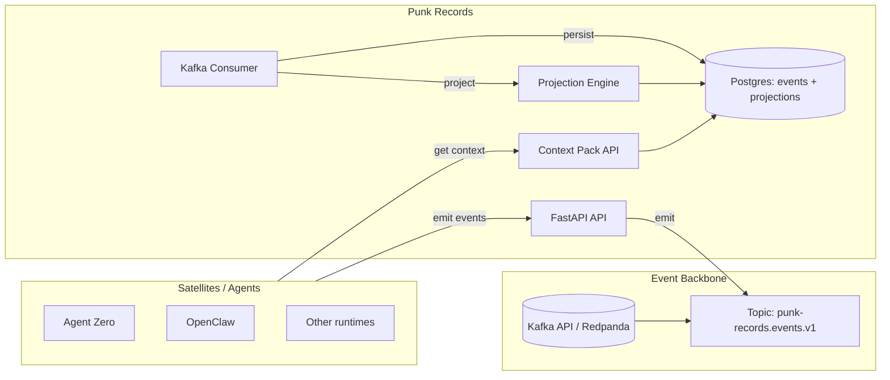

# Punk Records

**A governed, replayable memory backbone for AI agents.**

Punk records is a distributed cognitive system inspired by *Vegapunk’s satellites* — multiple agent runtimes (OpenClaw, Agent Zero, others) feeding a **single immutable event log** and a **governed memory layer**.

**agent47 is the “Stella”**: the coordinating mind that delegates work to satellites, gathers their outputs, and stays coherent via context packs.

At the center sits **Punk Records**: the service that ingests satellite events, persists them, builds deterministic projections, and serves **Context Packs** back to the Stella + satellites.

---

## The pitch (in one screen)

- **One source of truth:** an append-only event log (`punk-records.events.v1`)
- **Replayable state:** rebuild projections deterministically from events
- **Governed memory:** promote/retract memory with auditable rules
- **Multi-machine safe:** satellites never share a filesystem — they communicate via events
- **Adapters, not lock-in:** integrate OpenClaw + Agent Zero via thin adapters

---

## Architecture



**Mental model:**
1) Satellites do work → emit events
2) Punk Records persists events → builds projections
3) agent47 (Stella) + satellites request a *Context Pack* → compact, high-signal memory/decisions/tasks/risks

---

## Current status

- Epic 1 (**Core Backbone**) is implemented: ingest → validate → persist + consumer loop.
- Epic 2 (**Projections & memory governance**) is in progress (projection engine + replay endpoints exist; rules continue to evolve).
- Epics 3–5 define integrations, hardening, and scale.

See the roadmap: `docs/epics/ROADMAP.md`.

---

## API (current)

> Most endpoints require bearer auth:
> `Authorization: Bearer <PUNK_RECORDS_API_TOKEN>`

- `GET /health` (no auth)
- `POST /events` (auth) — emit an event envelope
- `GET /events` (auth) — query events by workspace/time/type
- `GET /memory/{workspace_id}` (auth) — query memory entries
- `GET /context/{workspace_id}` (auth) — fetch a Context Pack
- `POST /replay/{workspace_id}` (auth) — replay a workspace to rebuild projections

---

## Run locally (dev)

Prereqs: Docker + Docker Compose.

```bash
docker compose up --build
```

Ports (from `docker-compose.yml`):
- Punk Records API: `http://localhost:4701`
- Redpanda (Kafka): `localhost:4702`
- Postgres: `localhost:4704`

Health check:
- `GET http://localhost:4701/health`

---

## Punk Records Console (UI)

A web console is planned to make the system *visible* (events, memory, replay, context packs).

A ready-to-use Replit AI prompt lives here:
- `REPLIT_PROMPT_UI.md`

The UI is intentionally designed to scale through Epic 5 (satellites, adapters, observability).

---

## Roadmap (Epics)

- **Epic 1 — Event Backbone & Core Punk Records**
  - Immutable event ingestion + persistence
- **Epic 2 — Projections & Governed Memory**
  - Deterministic projections, promotion rules, replay
- **Epic 3 — Agent Zero Integration**
  - Adapter/tooling surface
- **Epic 4 — OpenClaw Integration**
  - Skill/plugin adapter
- **Epic 4.5 — Memory Sync Contract**
  - Canonical memory write path + conflict avoidance
- **Epic 5 — Observability, Hardening & Scale**
  - Lag monitoring, runbooks, auth hardening, perf validation

---

## Vision

Punk Records is built for a world where:
- multiple agents run on different machines,
- you want their “memory” to be **auditable**, **replayable**, and **governed**,
- and you refuse to debug a black box.

**If it happened, it’s an event.**
**If it matters, it becomes memory (with rules).**
**If you don’t trust it, replay it.**

---

## License

TBD (see repository state).
